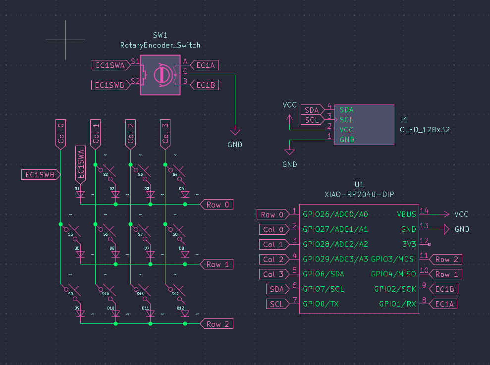
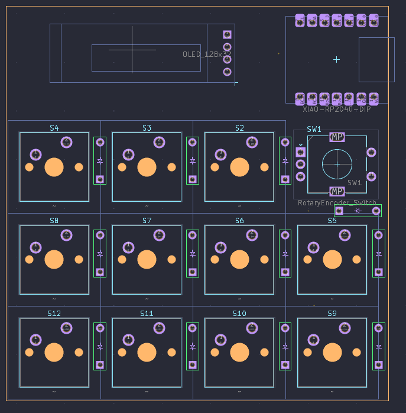

# Microkeyboard Hackpad

This is my hackpad project submission.

## Overview
I am making a micro keyboard in the QWERTY standard. The goal is to have at least 12 keys, 1 OLED display, and 1 rotary encoder.

## Images

### Schematic

### PCB

### Case

###BOM:

-12x Cherry MX Switches
-1x XIAO RP2040
-12x Keycaps
-1x Alps EC11E Rotary Encoder/Switch
-4x M3x16mm screws
-1x 3D Printed Case (2 parts)
